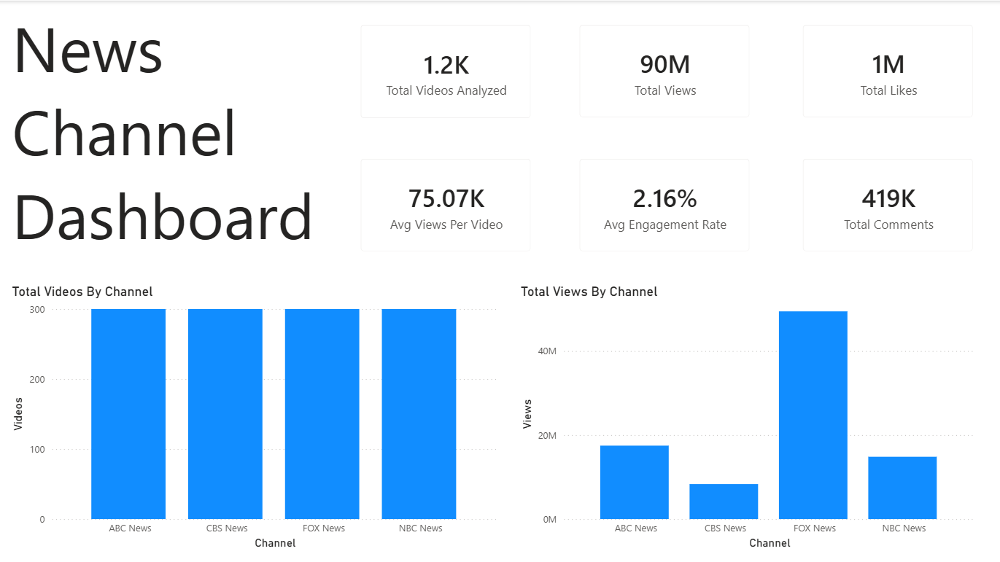
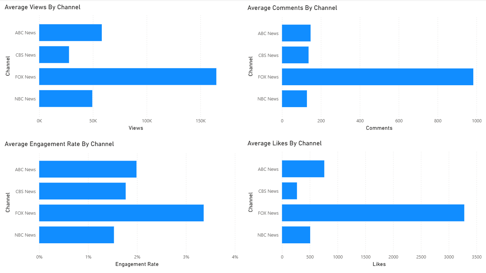
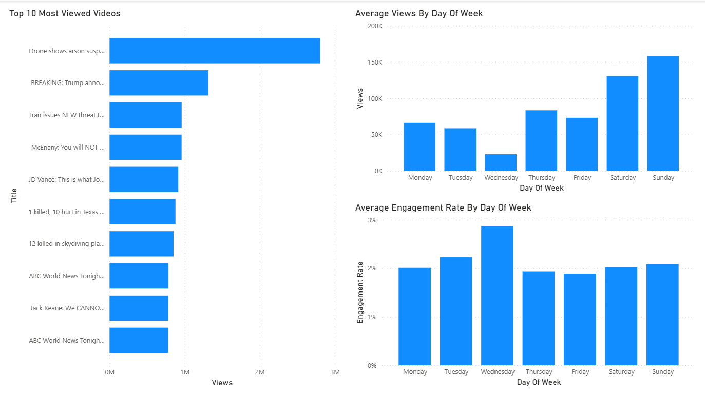

# Media Audience Analytics Dashboard

## Project Overview
Media organizations rely on audience analytics to understand how viewers interact with their content. Metrics such as views, likes, comments, and engagement rates help organizations evaluate publishing startegies and identify opportunities to improve their audience reach. 

## Business Problem 
News organizations publish multiple videos every day, making it difficult for them to identify which content performs best and what factors contributed to the audience engagement. 

The objective of this project was to answer business questions such as:

- Which channel receives the highest average views?
- Which channel has the strongest audience engagement?
- Which days of the week generate the highest performance?
- Which videos perform exceptionally well?

## Objectives 

The goals of this project were to:

- Collect publicly available YouTube data.
- Clean and prepare the dataset.
- Analyze audience engagement using SQL.
- Build a  dashboard in Power BI for visualization.
- Give business recommendations based on the findings.

## Dataset

**Source:** 
  
Youtube Data API

**Channels:**
- ABC News
- CBS News
- FOX News
- NBC News

**Dataset Size:**
- 1,200 videos 
- 300 videos collected from each news organization

**Timeline:**
 
June 11, 2026 to June 17, 2026

Each row represents a youtube video that contains information such as publication date, views, likes, comments, tags, and engagement metrics. 

## Tools Used

| Tool              | Purpose                     |
|-------------------|-----------------------------|
| Youtube Data API  | Retrieve video information  |
| Python            | Data Collection             |
| PostgreSQL        | Store and query data        |
| Power BI          | Dashboard creation          |
| Github            | Project Documentation       |

## Data Collection
The data used was collected using the Youtube Data API through a python file created by AI. 

The file: 
- Connected to the API 
- Retrieved videos from four news channels 
- Extracted the videos data 
- Saved the data on a csv file 
## Data Cleaning 
After obtaining all the data needed, I moved on to data cleaning. The first thing I noticed was the format of the published_at column. The column was downloaded as a string, so I converted it to a date format using Python. Converting the data type was necessary because it prevented errors and became useful throughout the project when writing queries and building the Power BI dashboard. 

Additionally, I created the engagement_rate column by adding the number of likes and comments and dividing the total by the number of views. This metric measures how many viewers interacted with each video.

## SQL Analysis 
The following business questions were answered:

1. Which channel has the highest average views? 
2. Which channel has the highest average comments?
3. Which channel has the highest average likes?
4. Which channel has the highest engagement rate?
5. Which day of the week has the highest number of views
6.  Which channel demonstrates the most consistent performance?
7. Which videos were the top 20 based on views?
8. Which videos were the top 20 based on engagement rate?
## Dashboard
This dashboard was designed to provide an overview of the audience engagement across four major U.S news organizations. It shows overall performance, compares metrics, and highlights content trends to support data driven decision.

The Power BI dashboard consists of three pages: 

### Summary
- Overall KPIs
- Total views
- Average engagement 
- Total videos analyzed

### Channel Comparison
- Average views
- Engagement rate
- Likes
- Comments

### Content Performance
- Top performing videos 
- Day of week analysis

## Key Findings
Analyzing 1,200 YouTube videos from four major U.S news organizations revealed several patterns. FOX News consistently outperformed the other channels across several key performance metrics, including views, likes, comments, and engagement rate. This suggests that FOX New's content has strong audeince engagement based on the data used. 

Additional analysis shows that publishing time may influence audience engagement. For example, Saturday and Sunday did well in terms of views. Lastly, the dashboard also highlighted that a small number of videos generated a large number of views, playing a significant role in the channel's performance. 

## Recommendations
The one week of June provided several insights about when users best interact with content. Based on the week analysis, Sunday and Saturday had the highest average views. This trend can be because people have more time on weekdays since most are off from work. There can also be more content on weekends due to events. These can all be reasons to schedule posts on weekdays, as they will get more views. 

Furthermore, the average engagement week analysis shows Wednesday has the highest peak engagement. Most users are likely to interact which boosts the audience reach. This information can help organizations on how to strategically publish their content. 
